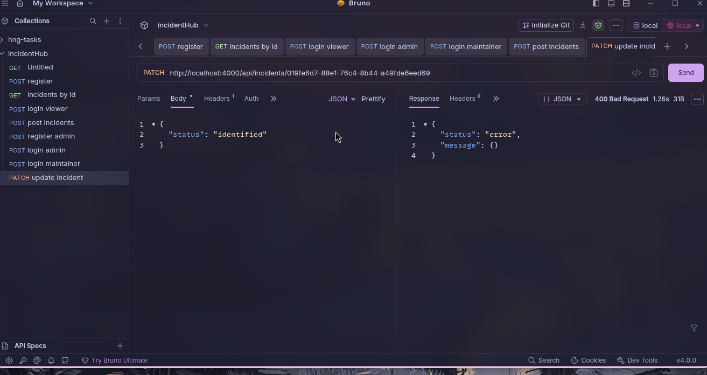

```js
if (req.user.role !== roles[0] || req.user.role !== roles)
```
The above is wrong because:
role = "admin":       false && true  → false → allowed  ✓
role = "maintainer":  true && false  → false → allowed  ✓
role = "viewer":      true && true   → true  → denied   ✓

instead use this:
```js
   if (req.user.role !== roles[0] && req.user.role !== roles[1])
```



the issue above was caused because the patch request had a title deconstructed and in a case where title isnt passed then the whole thing fails because slugify would fail because undefined can run a `toLowerCase()` method. So we have to make a check that tells the code to only run slugify when title is given.


```js
const io = getIO();
io.to(`incident:${id}`).emit("incident.updated", data);
```
**.to(room)** scopes the broadcast — only sockets that have actually joined incident:<id> receive the emit. Anyone connected to your server but sitting in a different room, or in no room at all, gets nothing. So yes, targeted, not a blast to everyone.

But there's a distinction worth being precise about, since it's easy to conflate: "joined the room" and "subscribed" are two completely separate things, even though the word feels similar.

**subscriptions table** — a person explicitly opted in, it's a DB row, it persists whether or not they're currently looking at anything. This is what your worker queries to send (mock) notifications.
**Socket room membership** — a person's browser tab is currently open to that incident's page and has run a "join this room" call. It's temporary, tied to being connected right now, and has nothing to do with the subscriptions table at all.